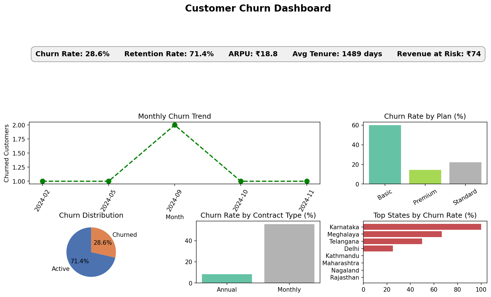
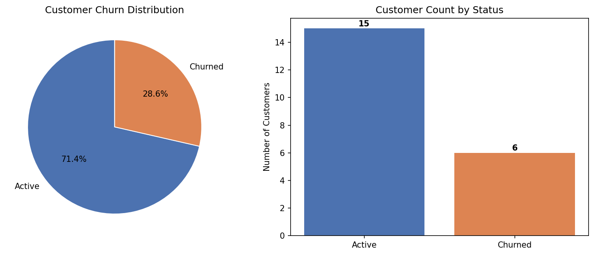
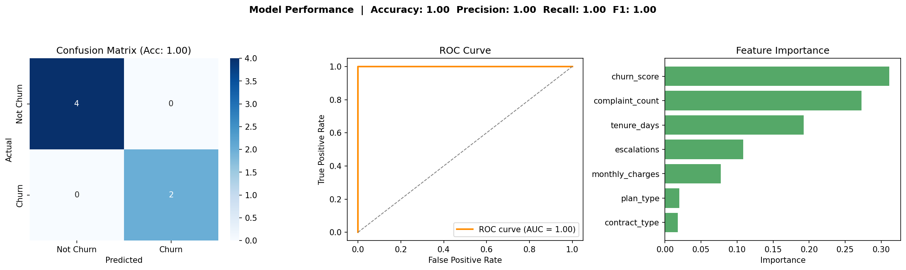

# 📊 Customer Churn Analysis & Prediction

> An end-to-end Data Analytics & Machine Learning project that analyzes customer behavior, identifies churn drivers, and predicts customers at risk of leaving using Python, SQL, and Machine Learning.


---

## 📌 Project Overview

Customer retention is a critical business challenge in the telecom industry. Losing customers directly impacts revenue and long-term profitability.

This project performs an end-to-end churn analysis by combining **SQL, Python, Exploratory Data Analysis (EDA), Data Visualization, and Machine Learning** to identify churn patterns and provide actionable business recommendations.

---

## 🎯 Problem Statement

Telecom companies often struggle to identify customers who are likely to leave before it happens.

The objective of this project is to:

- Analyze customer demographics and subscription behavior
- Identify factors influencing customer churn
- Predict customers likely to churn
- Generate business insights to improve customer retention and reduce revenue loss

---

## 🛠 Tech Stack

| Category | Tools |
|----------|-------|
| Programming | Python |
| Database | SQLite |
| Data Analysis | Pandas, NumPy |
| Visualization | Matplotlib, Seaborn |
| Machine Learning | Scikit-learn |
| Environment | Jupyter Notebook |

---

## 📂 Dataset

**Database:** `customer_churn.db`

The dataset contains customer information including:

- Customer demographics
- Subscription plans
- Contract details
- Service usage
- Revenue information
- Customer tenure
- Churn status (Target Variable)

---

## ⚙️ Project Workflow

```
Data Collection
        │
        ▼
SQL Database Extraction
        │
        ▼
Data Cleaning & Preprocessing
        │
        ▼
Exploratory Data Analysis
        │
        ▼
Feature Engineering
        │
        ▼
Machine Learning Model
        │
        ▼
Model Evaluation
        │
        ▼
Business Insights & Recommendations
```

---

## 📊 Key Performance Metrics

| Metric | Value |
|---------|-------|
| Customer Retention Rate | **71.4%** |
| Customer Churn Rate | **28.6%** |
| Average Customer Tenure | **1,451 Days** |
| Average Revenue Per User (ARPU) | **₹18.8** |
| Total Revenue | **₹395** |
| Revenue Lost Due to Churn | **₹74** |
| CLTV Lost | **₹2,047** |
| Revenue Loss | **18%** |

---

## 🔍 Key Business Insights

- 📉 **28.6%** of customers have churned while **71.4%** remain active.
- 📦 Most churn occurs in the **Basic Subscription Plan**, indicating lower immediate revenue impact but highlighting opportunities for improving customer retention.
- 📅 The highest churn was observed in **September 2024**, suggesting a possible business event or operational issue during that period.
- 📍 **Karnataka** recorded the highest number of churned customers.
- 💰 Average customer tenure is **1,451 days**, with an **ARPU of ₹18.8**.
- 💸 Customer churn resulted in an estimated **₹74 revenue loss**, representing **18%** of total revenue.
- 📈 The estimated **Customer Lifetime Value (CLTV) loss** is **₹2,047**.
- 📆 **Monthly subscribers** have a significantly higher churn rate (**55.6%**) compared to **Annual subscribers (8.3%)**, indicating stronger loyalty among long-term customers.

---

## 💼 Business Recommendations

Based on the analysis, the following actions are recommended:

- Investigate the high churn rate in **Karnataka** to identify service issues, pricing changes, or customer complaints.
- Review any pricing or product modifications made to the **Basic Subscription Plan**, particularly around **September 2024**.
- Analyze competitor offerings to understand customer migration trends.
- Prioritize customers with **High** and **Medium** churn risk by:
  - Reviewing their Customer Lifetime Value (CLTV)
  - Checking complaint and support history
  - Conducting proactive outreach via email, SMS, or phone calls
- Encourage customers to upgrade from **Monthly** to **Annual** subscription plans through loyalty programs or promotional discounts.

---

## 🤖 Machine Learning

The project includes a supervised machine learning model to classify customers as **Likely to Churn** or **Not Likely to Churn**.

The workflow includes:

- Data preprocessing
- Feature encoding
- Train-Test Split
- Model training
- Prediction
- Performance evaluation

---

## 📚 Skills Demonstrated

- SQL Database Analysis
- Data Cleaning
- Exploratory Data Analysis (EDA)
- Data Visualization
- Feature Engineering
- Machine Learning
- Business Analytics
- Customer Segmentation
- Churn Prediction
- Business Recommendation Generation

---

## 📁 Project Structure

```
Customer-Churn-Analysis/
│
├── data/
│   └── customer_churn.db
│
├── notebooks/
│   └── churn_analysis.ipynb
│
├── images/
│   ├── dashboard.png
│   ├── churn_distribution.png
│   ├── monthly_vs_annual.png
│   └── ...
│
├── requirements.txt
└── README.md
```

---

## 📸 Project Screenshots

### Dashboard





---

### Churn Analysis





---

### Model Results





---

## 🚀 Future Improvements

- Hyperparameter tuning
- Feature selection
- Model deployment using Streamlit
- Interactive Power BI dashboard
- Real-time churn prediction API
- Automated reporting pipeline

---

## 📬 Contact

**Sandeep**


Data Analyst | AI/ML Enthusiast  
Passionate about turning data into insights and building machine learning solutions.
